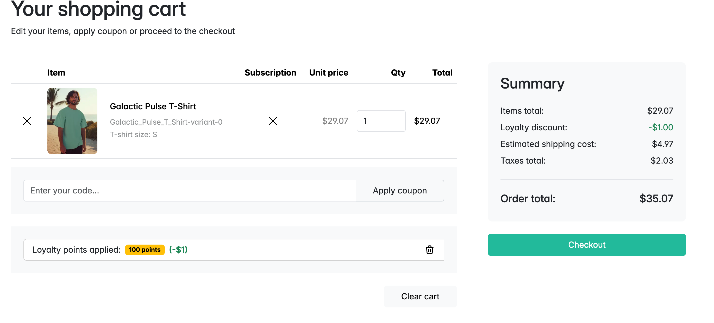
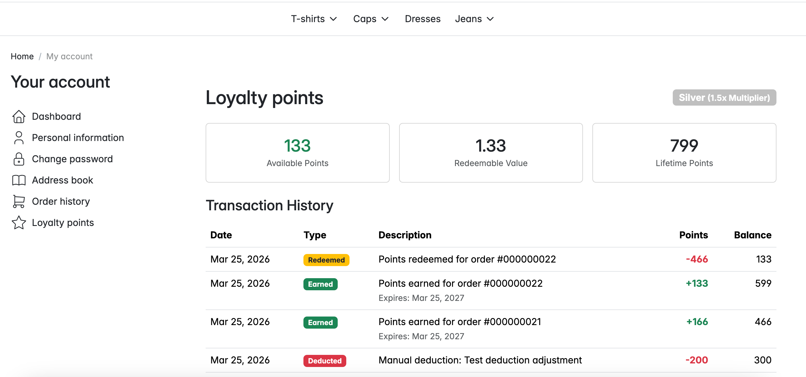
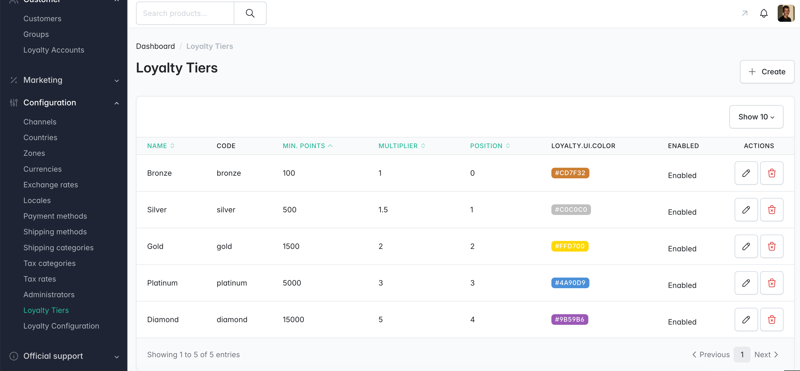

<p align="center">
    <a href="https://sylius.com" target="_blank">
        <picture>
            <source media="(prefers-color-scheme: dark)" srcset="https://media.sylius.com/sylius-logo-800-dark.png">
            <source media="(prefers-color-scheme: light)" srcset="https://media.sylius.com/sylius-logo-800.png">
            
        </picture>
    </a>
</p>

<h1 align="center">Sylius Loyalty Plugin</h1>

<p align="center">
    A points-based loyalty and rewards system for <a href="https://sylius.com">Sylius 2.x</a> e-commerce stores.
</p>

<p align="center">
    <a href="https://github.com/abderrahimghazali/sylius-loyalty-plugin/actions/workflows/ci.yaml"></a>
    <a href="https://packagist.org/packages/abderrahimghazali/sylius-loyalty-plugin"></a>
    <a href="https://packagist.org/packages/abderrahimghazali/sylius-loyalty-plugin"></a>
    <a href="LICENSE"></a>
    <a href="https://packagist.org/packages/abderrahimghazali/sylius-loyalty-plugin"></a>
    <a href="https://packagist.org/packages/abderrahimghazali/sylius-loyalty-plugin"></a>
    <a href="https://img.shields.io/badge/PHPStan-level%205-brightgreen"></a>
</p>

---

## Overview

SyliusLoyaltyPlugin adds a complete loyalty program to any Sylius 2.x store. Customers earn points on purchases, redeem them as discounts on the cart page, unlock tier-based multipliers, and receive bonus points for registration, birthdays, and first orders — all configurable per channel from the admin panel.

### Key Features

- **Multi-channel** — Each channel has independent earning rates, redemption rates, expiry, and bonus settings
- **Per-product/category earning rules** — Override earning rates for specific taxons, products, or variants with time-limited promotions
- **Points earning** — Configurable default points per currency unit on every order
- **Cart redemption** — Spend points as a monetary discount on the cart page
- **Points expiry** — Automatic expiration with cron command + 30-day warnings
- **Bonus events** — Registration, birthday, and first-order bonuses (toggle on/off per channel)
- **Tier system** — Bronze / Silver / Gold with earning multipliers (tiers only go up)
- **Admin panel** — Full management: accounts, transactions, manual adjustments, per-channel config
- **Customer account** — Points balance, tier badge, paginated transaction history with running balance
- **REST API** — Headless-ready endpoints for balance and redemption
- **Workflow integration** — Points deducted on order complete, restored on cancel/refund
- **Translations** — English, French, German, Spanish, Polish, Portuguese

## Requirements

| Dependency | Version |
|---|---|
| PHP | ^8.2 |
| Sylius | ~2.1 |
| Symfony | ^7.0 |

## Installation

```bash
composer require abderrahimghazali/sylius-loyalty-plugin
```

### 1. Register the plugin

```php
// config/bundles.php
return [
    // ...
    Abderrahim\SyliusLoyaltyPlugin\SyliusLoyaltyPlugin::class => ['all' => true],
];
```

### 2. Import routes

```yaml
# config/routes/sylius_loyalty.yaml
sylius_loyalty:
    resource: '@SyliusLoyaltyPlugin/config/routes.yaml'
```

### 3. Extend your Order entity

Add the loyalty trait to your Order entity so customers can redeem points on the cart page:

```php
// src/Entity/Order/Order.php
namespace App\Entity\Order;

use Abderrahim\SyliusLoyaltyPlugin\Entity\Order\LoyaltyOrderInterface;
use Abderrahim\SyliusLoyaltyPlugin\Entity\Order\LoyaltyOrderTrait;
use Sylius\Component\Core\Model\Order as BaseOrder;
use Doctrine\ORM\Mapping as ORM;

#[ORM\Entity]
#[ORM\Table(name: 'sylius_order')]
class Order extends BaseOrder implements LoyaltyOrderInterface
{
    use LoyaltyOrderTrait;

    // ...existing code...
}
```

### 4. Register the Stimulus controller (for the cart widget)

Add the plugin JS dependency to your `package.json`:

```json
{
    "dependencies": {
        "@abderrahimghazali/sylius-loyalty-plugin": "file:vendor/abderrahimghazali/sylius-loyalty-plugin/assets"
    }
}
```

Register the controller in `assets/shop/controllers.json`:

```json
{
    "controllers": {
        "@abderrahimghazali/sylius-loyalty-plugin": {
            "loyalty-redemption": {
                "enabled": true,
                "fetch": "eager"
            }
        }
    }
}
```

Then rebuild assets:

```bash
npm install
npm run build
```

### 5. Run migrations

```bash
php bin/console doctrine:migrations:diff
php bin/console doctrine:migrations:migrate
```

### 6. Seed the default configuration

```bash
php bin/console loyalty:install
```

This creates a default loyalty configuration for each channel. You can then customize settings per channel from the admin panel under **Configuration > Loyalty Configuration**.

### 7. Set up cron jobs

```bash
# Expire old points (run daily)
php bin/console loyalty:expire-points

# Award birthday bonuses (run daily)
php bin/console loyalty:birthday-bonus
```

## Architecture

### Domain Model

```
Channel ──1:1──▶ LoyaltyConfiguration
                    (earning rate, redemption rate, expiry, bonuses)

Channel ──1:N──▶ LoyaltyEarningRule
                    (scope: taxon/product/variant, target codes, rate override)

Customer ──1:1──▶ LoyaltyAccount ──1:N──▶ PointTransaction
                        │                    (earn/redeem/expire/adjust/bonus)
                        │
                        └───N:1──▶ LoyaltyTier
                                   (Bronze/Silver/Gold)
```

Points are **shared across channels** (one account per customer), while earning/redemption rates are **configured per channel**.

### Entities

| Entity | Purpose |
|---|---|
| `LoyaltyAccount` | Per-customer account with balance, lifetime points, tier |
| `PointTransaction` | Ledger entry — signed points, type, optional order link, expiry |
| `LoyaltyTier` | Tier with min-points threshold, earning multiplier, color |
| `LoyaltyConfiguration` | Per-channel config: earning rate, redemption rate, expiry, bonuses |
| `LoyaltyEarningRule` | Per-channel rate override for specific taxons, products, or variants |

### Sylius Integration Points

| Extension Point | What It Does |
|---|---|
| `OrderProcessorInterface` (priority 5) | Applies loyalty discount adjustment after taxes |
| `sylius.order.post_complete` event | Awards earn points + first-order bonus on order completion |
| `sylius.order.post_cancel` event | Revokes earned points |
| `sylius.customer.post_register` event | Awards registration bonus |
| `workflow.sylius_order_checkout.completed.complete` | Deducts redeemed points from balance |
| `workflow.sylius_order.completed.cancel` | Restores redeemed points |
| `workflow.sylius_payment.completed.refund` | Restores redeemed points on refund |
| `sylius.menu.admin.main` event | Adds menu items under Customers & Configuration |
| Twig hooks | Cart widget, cart/checkout summary, customer show section, account menu |

## Multi-Channel Support

Each Sylius channel can have its own loyalty configuration:

| Setting | US Store | EU Store | B2B Store |
|---|---|---|---|
| Earning rate | 1 pt / $1 | 2 pts / €1 | Disabled |
| Redemption rate | 100 pts = $1 | 50 pts = €1 | N/A |
| Registration bonus | 100 pts | 200 pts | 0 |
| Birthday bonus | 200 pts | 500 pts | 0 |
| Tiers enabled | Yes | Yes | No |

Points are shared across channels — a customer earns on one store and redeems on another. Rates are applied based on the order's channel.

Manage per-channel settings at **Configuration > Loyalty Configuration** in the admin panel.

## Shop Features

### Cart Redemption Widget

On the cart page, logged-in customers can redeem points as a discount. The widget uses Symfony UX Live Components for seamless interaction without page reloads.

- Input field with placeholder showing available balance
- "Apply points" button (triggers Live Component re-render)
- Applied state shows a badge with points count, discount value, and a remove button
- Loyalty discount line appears in the cart summary and throughout the checkout sidebar
- Automatic clamping: can't exceed balance or order total

### Customer Account — Loyalty Page

Accessible from the account sidebar menu:

- Current balance + redeemable monetary value
- Tier badge with multiplier info
- Expiry warning for points expiring within 30 days
- Paginated transaction history table with running balance column

## Admin Features

### Loyalty Accounts

Grid view of all customer loyalty accounts with balance, lifetime points, tier, and status. Click through to a detail page showing paginated transaction history.

### Manual Point Adjustment

From any loyalty account detail page, admins can add or deduct points with a required reason field. Positive values create an `Adjust` (credit) transaction, negative values create a `Deduct` (debit) transaction.

### Tier Management

Full CRUD for loyalty tiers under **Configuration > Loyalty Tiers**. Code and position are auto-generated from the tier name.

| Field | Description |
|---|---|
| Name | Display name (e.g., "Bronze") — code is auto-generated |
| Min Points | Lifetime points threshold to reach this tier |
| Multiplier | Earning multiplier (e.g., 1.5x for Silver) |
| Color | Badge color (hex, rendered in admin and shop) |

### Per-Channel Configuration

Under **Configuration > Loyalty Configuration**, admins see a table of all channels and can configure each independently:

- Points per currency unit
- Redemption rate (points per 1 currency unit)
- Expiry period in days
- Enable/disable tier system
- Toggle and configure bonus events (registration, birthday, first order)

Settings are stored in the database and take effect immediately without redeployment.

### Earning Rules

Under **Configuration > Earning Rules**, admins can override the default earning rate for specific categories, products, or variants. The index page offers three create buttons:

- **Category rule** — select one or more taxons (multi-select autocomplete)
- **Product rule** — select one or more products
- **Variant rule** — select one or more specific variants

Each rule specifies a points-per-currency-unit rate, an optional date range (for time-limited promotions like "double points this week"), a priority, and a channel.

**Specificity resolution**: When a product matches multiple rules, the most specific wins: Variant > Product > Category > Channel default. Within the same scope level, higher priority wins. The grid shows a **Conflicts** column warning when rules overlap at the same scope level.

**Example rules:**

| Rule | Scope | Targets | Rate |
|---|---|---|---|
| Double on Dresses | Category | Dresses | 2 pts/€1 |
| No points on gift cards | Product | Gift Card | 0 pts/€1 |
| 5x on new collection | Category | New Arrivals | 5 pts/€1 |
| Premium variant bonus | Variant | XL Gold Edition | 10 pts/€1 |

## API Endpoints (Headless)

For headless/SPA storefronts, the plugin provides REST endpoints. All shop endpoints verify the authenticated user owns the order.

### Shop API

```
POST   /api/v2/shop/orders/{tokenValue}/loyalty-redemption
       Body: { "pointsToRedeem": 500 }
       → { "pointsRedeemed": 500, "discountAmount": 500, "orderTotal": 9500 }

DELETE /api/v2/shop/orders/{tokenValue}/loyalty-redemption
       → { "pointsRedeemed": 0, "discountAmount": 0, "orderTotal": 10000 }

GET    /api/v2/shop/loyalty/account
       → Balance, lifetime points, tier info
```

### Admin API

```
GET    /api/v2/admin/loyalty/accounts
GET    /api/v2/admin/loyalty/accounts/{id}
PATCH  /api/v2/admin/loyalty/accounts/{id}
```

## Edge Cases Handled

- Pessimistic DB locking prevents double-spend on concurrent checkouts
- API endpoints verify the authenticated user owns the order
- Balance cannot go negative (clamped in service layer + guard in entity)
- Points redemption cannot exceed available balance (clamped)
- Discount cannot exceed order total (capped, points recalculated)
- Guest checkouts cannot use loyalty points (guarded)
- Disabled accounts are excluded from earning and redemption
- Duplicate point awards are prevented (idempotent per order)
- First-order bonus awarded only once (idempotent)
- Points are reserved at cart, deducted only on order completion
- Cancelled/refunded orders restore redeemed points (idempotent)
- Birthday bonus awarded at most once per calendar year per channel
- Tiers only upgrade, never demote (based on lifetime points)

## Translations

The plugin ships with translations for:

| Language | File |
|---|---|
| English | `messages.en.yaml` |
| French | `messages.fr.yaml` |
| German | `messages.de.yaml` |
| Spanish | `messages.es.yaml` |
| Polish | `messages.pl.yaml` |
| Portuguese | `messages.pt.yaml` |

## Running Tests

```bash
composer install
vendor/bin/phpunit
```

71 unit tests covering entities, services, order processing, and all event listeners.

## Screenshots

**Cart — Redeem points**



**Customer Account — Loyalty points & transaction history**



**Admin — Loyalty tiers management**



## License

This plugin is released under the [MIT License](LICENSE).
